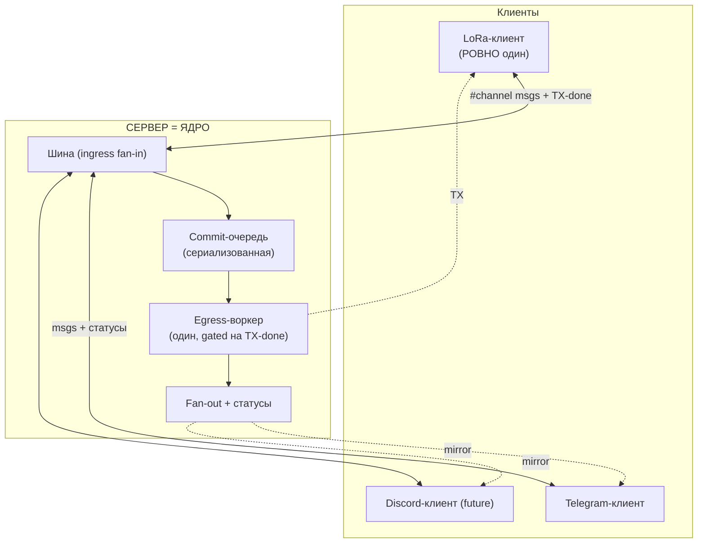
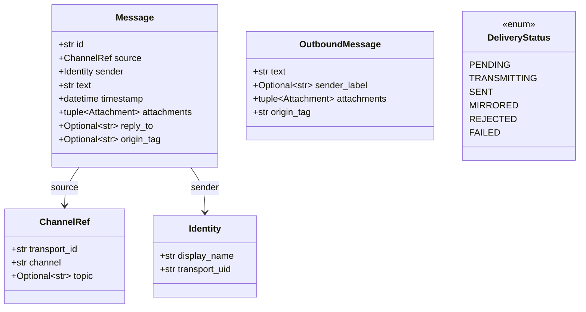
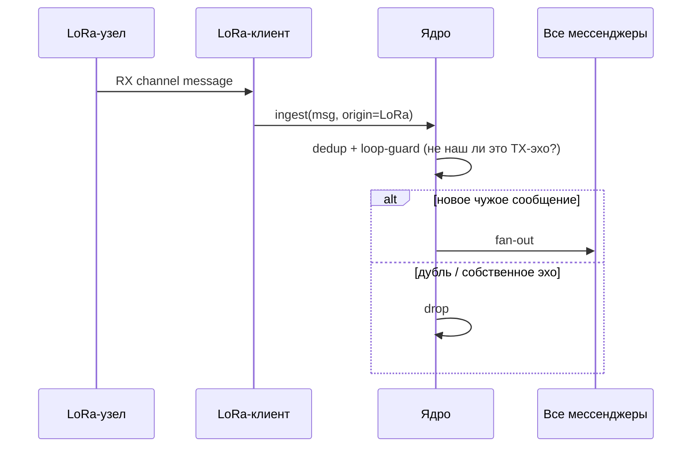
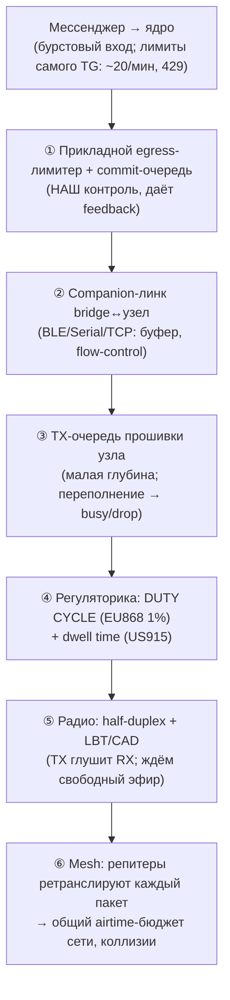
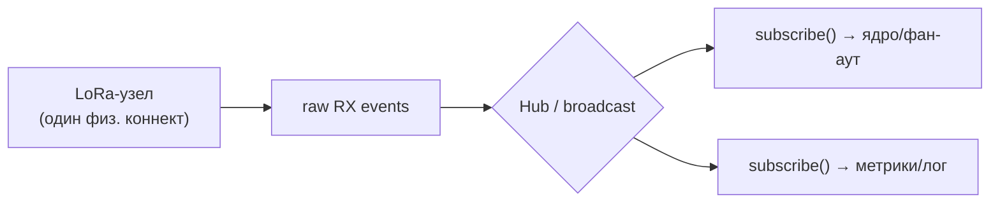
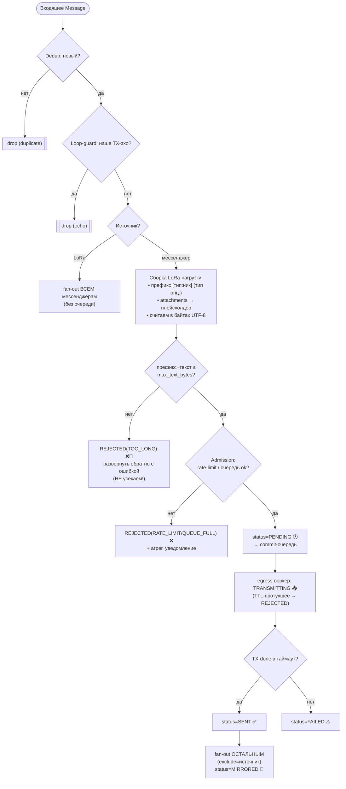
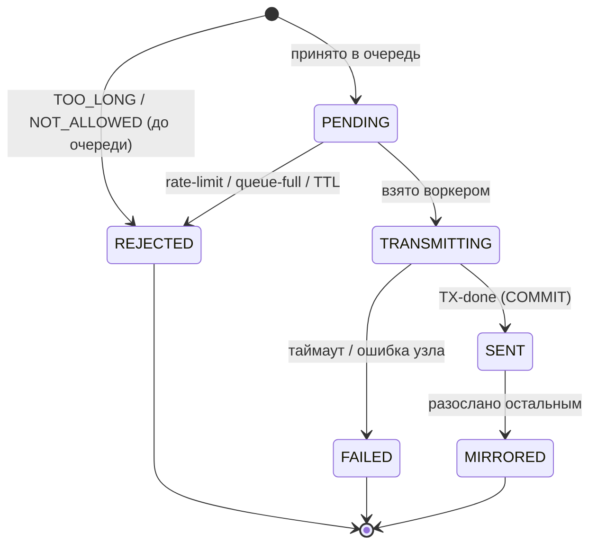
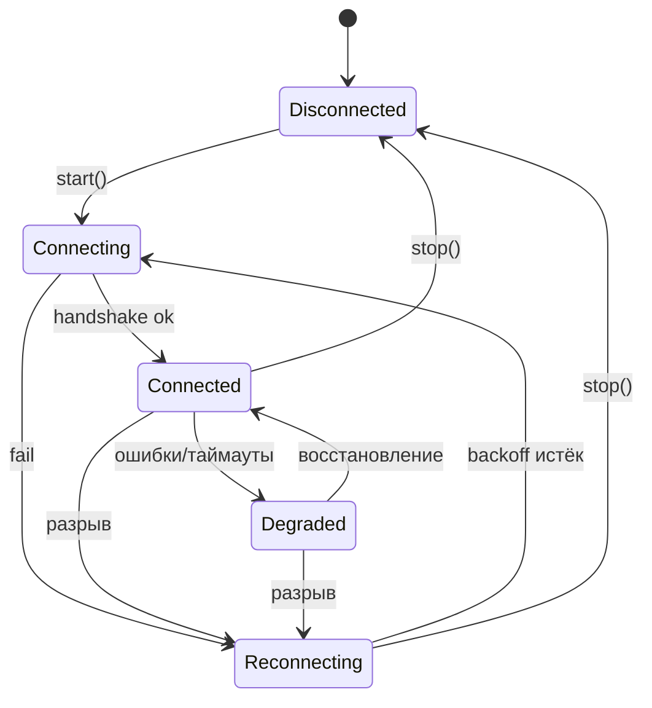
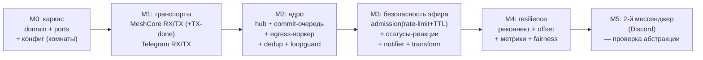

# MeshCore-Bridge — Архитектура

> Дуплексный мост между LoRa-mesh сетью (MeshCore / Meshtastic / Reticulum) и
> мессенджерами (MVP — Telegram). Документ предназначен как рабочее ТЗ: по нему
> можно реализовать систему «с нуля».

## Содержание

1. [Цели и границы](#1-цели-и-границы)
2. [Ключевые архитектурные решения](#2-ключевые-архитектурные-решения)
3. [Топология: клиент-сервер](#3-топология-клиент-сервер)
4. [Доменная модель](#4-доменная-модель)
5. [Порты и абстракции](#5-порты-и-абстракции)
6. [Ядро: commit-очередь и фан-аут](#6-ядро-commit-очередь-и-фан-аут)
7. [Где живёт rate limit](#7-где-живёт-rate-limit)
8. [Реактивные потоки в asyncio](#8-реактивные-потоки-в-asyncio)
9. [Конвейер обработки сообщения](#9-конвейер-обработки-сообщения)
10. [Статусы доставки и фидбек](#10-статусы-доставки-и-фидбек)
11. [Жизненный цикл соединения](#11-жизненный-цикл-соединения)
12. [Конфигурация](#12-конфигурация)
13. [Структура пакета](#13-структура-пакета)
14. [🔥 Прожарка: косяки и корнер-кейсы](#14-прожарка-косяки-и-корнер-кейсы)
15. [Этапы реализации](#15-этапы-реализации)

---

## 1. Цели и границы

**Что делаем (MVP):**

- Принимаем поток сообщений из заданного **хештег-канала LoRa** (MeshCore) и
  публикуем их в **каналы/темы мессенджеров** (Telegram), один-ко-многим.
- Принимаем сообщения из мессенджеров (с поддержкой тем/threads), отправляем их
  в LoRa-канал и зеркалим остальным подписчикам — **дуплекс**.
- LoRa-узел **ровно один** и выступает единым источником правды (commit-log).

**Чего сознательно НЕ делаем в MVP:**

- Не передаём вложения (фото/голос/файлы) в LoRa — только текстовые
  плейсхолдеры (`[photo]`, ссылка и т.п.).
- Не гарантируем доставку *получателю* в LoRa (канальные сообщения MeshCore
  ACK не имеют — см. §2, AD-5).
- Без веб-UI/админки — только конфиг-файл.

**Ключевые ограничения предметной области (определяют всю архитектуру):**

| Сторона | Ограничение | Следствие |
|---|---|---|
| LoRa | Узкий канал: десятки байт на пакет, строгий **duty cycle** (EU868 1%) | rate-limit + проверка размера (reject, без усечения) + admission control |
| LoRa | Канальные сообщения без ACK, без backfill после простоя | at-most-once; commit = факт передачи в эфир (TX-done) |
| LoRa | Возможны дубликаты пакетов (mesh-ретрансляция) | обязательная дедупликация |
| LoRa | Радио half-duplex, один узел = одна очередь TX | сериализованный egress-воркер в ядре |
| LoRa | Нет тем/threads, имена узлов короткие | темы только в мессенджере; маркировка отправителя |
| Telegram | Высокий объём, темы, вложения, длинные сообщения (4096) | источник «потопа» для LoRa; асимметрия |
| Telegram | Бот по умолчанию не видит сообщения группы (privacy mode) | требуется отключить privacy mode |
| Оба | Соединение нестабильно (BLE/Serial/TCP, long-polling) | resilience: reconnect, resume |

---

## 2. Ключевые архитектурные решения

| # | Решение | Обоснование |
|---|---|---|
| AD-1 | **Гексагональная архитектура (ports & adapters)** | Ядро не знает про MeshCore/Telegram. Транспорт = адаптер к порту `Transport`. |
| AD-2 | **Единый порт `Transport`** для LoRa и мессенджеров; различия — через `Capabilities` | Не плодим параллельные иерархии; ядро не ветвится по типу транспорта. |
| AD-3 | **Клиент-сервер**: сервер = ядро, клиенты = транспорты; **LoRa-клиент один** | Ядро — шина и арбитр; естественно даёт 1-ко-многим. |
| AD-4 | **LoRa как commit-log**: сообщение из мессенджера сначала уходит в эфир, и только по **TX-done** зеркалится остальным | Единый источник правды и порядок; мессенджеры — зеркала канала, а не отдельные чаты. |
| AD-5 | **Commit = TX-done** (узел подтвердил передачу в эфир) | Сильнейший правдивый сигнал: delivery-ACK у канальных сообщений нет. |
| AD-6 | **Сериализованная commit-очередь** + один egress-воркер с таймаутом TX-done | Один радиоузел физически сериализует TX; синхронный gated fan-out. |
| AD-7 | **Статус-фидбек в мессенджеры** (реакция-индикатор) | Дуплекс = поток сообщений + поток статусов; пользователь видит судьбу сообщения. |
| AD-8 | **Egress rate-limit + drop + уведомление** на стороне LoRa | Защита эфира/duty cycle; см. §7. |
| AD-9 | **Loop-guard + dedup** обязательны | Мультикаст + RX-эхо собственных TX создают петли/дубли. |
| AD-10 | **Обязательный префикс `[тип:ник]`** в каждом сообщении из мессенджера в LoRa; тип опускается, если в комнату пишет ровно один мессенджер | Получатель в эфире должен видеть автора и источник; ник — не опционален. |
| AD-11 | **Размер — all-or-nothing: НЕ усекаем.** Если `префикс+текст` не влезает в `max_text_bytes` — сразу `REJECTED(TOO_LONG)` обратно в мессенджер | Молчаливая потеря части слов пользователя хуже явной ошибки; усечение искажает смысл. |

---

## 3. Топология: клиент-сервер



Двусторонние стрелки = дуплекс на каждом ребре. Один LoRa-клиент обслуживает все
мессенджеры (мультикаст RX в ядре, §8). «1-ко-многим» — свойство топологии:
к одному LoRa-каналу подписано N мессенджер-эндпоинтов.

**Два пути сообщения (асимметрия источников):**

- **Из мессенджера** → ядро → **commit-очередь** → TX в узел → ждём TX-done →
  фан-аут остальным мессенджерам + статус источнику.
- **Из LoRa** → RX → dedup + loop-guard → фан-аут **всем** мессенджерам
  **в обход очереди** (сообщение уже в эфире, коммитить нечего).

---

## 4. Доменная модель



```python
# domain/models.py  (ключевые типы)
from enum import Enum
from dataclasses import dataclass
from typing import Optional
import datetime as dt


@dataclass(frozen=True)
class ChannelRef:
    transport_id: str
    channel: str
    topic: Optional[str] = None      # message_thread_id; None для LoRa


@dataclass(frozen=True)
class Identity:
    display_name: str
    transport_uid: str


@dataclass(frozen=True)
class Message:
    id: str                          # стабильный id транспорта (для dedup)
    source: ChannelRef
    sender: Identity
    text: str
    timestamp: dt.datetime           # UTC, tz-aware (проставляет ядро на ingress)
    attachments: tuple = ()
    reply_to: Optional[str] = None
    origin_tag: Optional[str] = None  # loop-guard


@dataclass(frozen=True)
class OutboundMessage:
    text: str
    sender_label: Optional[str] = None   # префикс "[TG:Alex]" для LoRa
    attachments: tuple = ()
    origin_tag: str = ""


class DeliveryStatus(Enum):
    PENDING = "pending"            # принято в commit-очередь
    TRANSMITTING = "transmitting"  # взято воркером, отдано узлу
    SENT = "sent"                  # TX-done подтверждён узлом (COMMIT)
    MIRRORED = "mirrored"          # разослано остальным подписчикам
    REJECTED = "rejected"          # admission отклонил (см. RejectReason)
    FAILED = "failed"              # нет TX-done в таймаут / ошибка узла


class RejectReason(Enum):
    TOO_LONG = "too_long"          # префикс+текст > max_text_bytes (НЕ усекаем)
    RATE_LIMIT = "rate_limit"      # token-bucket исчерпан
    QUEUE_FULL = "queue_full"      # bounded-очередь переполнена
    TTL_EXPIRED = "ttl_expired"    # протухло в очереди до отправки
    NOT_ALLOWED = "not_allowed"    # отправитель/чат вне allow-list


@dataclass(frozen=True)
class RateSpec:
    msgs_per_window: int
    window_seconds: float
    burst: int = 1


@dataclass(frozen=True)
class Capabilities:
    supports_topics: bool
    max_text_bytes: int
    egress_rate: Optional[RateSpec] = None
    supports_attachments: bool = False
    supports_status_feedback: bool = False   # умеет показать статус (реакция)
    emits_tx_done: bool = False              # узел отдаёт TX-done (commit)
```

### Сборка LoRa-нагрузки (префикс)

Сообщение из мессенджера разворачивается в LoRa как `«<префикс><текст>»`, где
префикс несёт **автора** и (условно) **тип мессенджера**:

```
несколько мессенджеров пишут в комнату → "[TG:Alex] привет"
только один мессенджер пишет в комнату → "[Alex] привет"
```

```python
def build_lora_payload(msg: Message, room: Room, fmt: LabelFormat) -> bytes:
    nick = msg.sender.display_name
    # тип опускаем, если в комнату пишет ровно один мессенджер (AD-10)
    if room.writable_messenger_count > 1 and fmt.include_type:
        label = f"[{msg.source.transport_kind}:{nick}] "   # "[TG:Alex] "
    else:
        label = f"[{nick}] "                                # "[Alex] "
    return (label + msg.text).encode("utf-8")
```

- **Префикс ест бюджет** `max_text_bytes` (он часть полезной нагрузки). Бюджет
  текста = `max_text_bytes − len(label_bytes)`.
- **Тип мессенджера** (`transport_kind`: `TG`/`DC`/…) берётся из адаптера
  источника, а не из текста пользователя (защита от подмены, D5).
- Решение «один/несколько мессенджеров» — на уровне **комнаты**
  (`writable_messenger_count` — сколько мессенджер-эндпоинтов с правом записи в
  LoRa подписано на этот канал).

---

## 5. Порты и абстракции

И LoRa-клиент, и мессенджер реализуют один протокол `Transport`. Дуплекс теперь
включает **обратный канал статусов** (`report_status`) — для отрисовки реакции.

```python
# domain/ports.py
from typing import AsyncIterator, Protocol, runtime_checkable
from .models import (Capabilities, ChannelRef, Message,
                     OutboundMessage, DeliveryStatus)


@runtime_checkable
class Transport(Protocol):
    id: str
    capabilities: Capabilities

    async def start(self) -> None: ...
    async def stop(self) -> None: ...

    # Исходящая сторона. Для LoRa send() РЕЗОЛВИТСЯ по TX-done узла,
    # а не по факту записи в линк (см. AD-5/AD-6).
    async def send(self, target: ChannelRef, msg: OutboundMessage) -> "SendResult": ...

    # Горячий мультикаст-поток входящих (см. §8).
    def subscribe(self) -> AsyncIterator[Message]: ...

    # Обратный канал статусов. No-op, если supports_status_feedback=False.
    # reason заполняется только для REJECTED (см. RejectReason).
    async def report_status(self, origin: ChannelRef, message_id: str,
                            status: DeliveryStatus,
                            reason: "Optional[RejectReason]" = None) -> None: ...
```

Адаптеры (примеры `capabilities`):

```python
# MeshCore: медленный коммит-источник, без тем, отдаёт TX-done, без статусов
MeshCoreTransport.capabilities = Capabilities(
    supports_topics=False, max_text_bytes=160,
    egress_rate=RateSpec(6, 60),          # консервативно под duty cycle
    supports_attachments=False,
    supports_status_feedback=False, emits_tx_done=True)

# Telegram: быстрый, темы, вложения, умеет реакции-статусы
TelegramTransport.capabilities = Capabilities(
    supports_topics=True, max_text_bytes=4096,
    egress_rate=RateSpec(20, 60, burst=20),
    supports_attachments=True,
    supports_status_feedback=True, emits_tx_done=False)
```

> **Реализация TX-done для MeshCore.** `send()` LoRa-адаптера не возвращается по
> записи в companion-линк, а ждёт события **TX-done** от прошивки (с таймаутом).
> Так «успешно отправлено в узел» = «физически ушло в эфир», что и есть наш
> commit. Если прошивка не отдаёт TX-done — деградируем до queue-ACK с
> предупреждением (и помечаем коммит как «слабый»).

---

## 6. Ядро: commit-очередь и фан-аут

Ядро — сервер. Сообщения из мессенджеров проходят через **одну сериализованную
очередь** и **один egress-воркер**, потому что радиоузел физически передаёт по
одному пакету за раз.

```mermaid
sequenceDiagram
    participant U as User (Telegram-A)
    participant TGc as Telegram-клиент
    participant Q as Ядро: commit-очередь
    participant W as Ядро: egress-воркер (один)
    participant N as LoRa-узел
    participant Oth as Другие мессенджеры

    U->>TGc: пишет сообщение
    TGc->>Q: ingest(msg)
    Note over Q: сборка [тип:ник]+текст; размер? rate-limit? очередь?
    alt префикс+текст > лимита
        Q-->>TGc: REJECTED(TOO_LONG) 📏 (сразу, НЕ усекаем)
    else rate-limit / очередь полна
        Q-->>TGc: REJECTED ❌ (+ агрег. уведомление)
    else принято
        Q-->>TGc: PENDING 🕐
        W->>Q: pull (FIFO, по одному)
        W-->>TGc: TRANSMITTING 📤
        W->>N: send_channel(text)
        alt TX-done в таймаут
            N-->>W: TX-done
            W-->>TGc: SENT ✅
            W->>Oth: mirror(text)
            W-->>TGc: MIRRORED 📡
        else таймаут / ошибка узла
            N--xW: нет TX-done
            W-->>TGc: FAILED ⚠️
        end
    end
```

Путь из LoRa (в обход очереди):



Скелет:

```python
# core/bridge.py
class Bridge:
    async def run(self):
        async with anyio.create_task_group() as tg:
            for t in self.transports.values():
                await t.start()
                tg.start_soon(self._consume, t)
            tg.start_soon(self._egress_worker)        # ОДИН воркер на узел

    async def _consume(self, t: Transport):
        async for msg in t.subscribe():
            if not self.dedup.accept(msg):     continue   # дубль пакета
            if self.loop_guard.is_echo(msg):   continue   # наш TX вернулся как RX
            if self._is_lora_origin(msg):
                await self._fanout_to_messengers(msg, exclude=None)
            else:
                await self._admit(msg)                     # в commit-очередь

    async def _admit(self, msg):
        room = self.rooms.for_source(msg.source)
        payload = build_lora_payload(msg, room, self.label_fmt)   # префикс [тип:ник]

        # AD-11: НЕ усекаем. Не влезло — сразу разворачиваем обратно с ошибкой.
        if len(payload) > self.lora.capabilities.max_text_bytes:
            over = len(payload) - self.lora.capabilities.max_text_bytes
            await self._reject(msg, RejectReason.TOO_LONG, detail=f"+{over} Б")
            return

        ok, reason = self.queue.offer(msg, payload)   # bounded + rate-limit + TTL
        if not ok:
            await self._reject(msg, reason)           # RATE_LIMIT / QUEUE_FULL
            return
        await self._set_status(msg, DeliveryStatus.PENDING)

    async def _reject(self, msg, reason, detail=""):
        await self._set_status(msg, DeliveryStatus.REJECTED, reason=reason)
        await self.notifier.note_reject(msg.source, reason, detail)   # debounce

    async def _egress_worker(self):
        async for msg, payload in self.queue:              # FIFO, payload уже собран
            if self.queue.is_stale(msg):                   # protух по TTL в очереди
                await self._reject(msg, RejectReason.TTL_EXPIRED)
                continue
            await self._set_status(msg, DeliveryStatus.TRANSMITTING)
            res = await with_timeout(self.lora.send_raw(payload), self.tx_timeout)
            if res.ok:                                     # TX-done
                await self._set_status(msg, DeliveryStatus.SENT)
                await self._fanout_to_messengers(msg, exclude=msg.source.transport_id)
                await self._set_status(msg, DeliveryStatus.MIRRORED)
            else:
                await self._set_status(msg, DeliveryStatus.FAILED)
```

---

## 7. Где живёт rate limit

Rate limit — **не одна точка, а вложенная лестница**. Наш прикладной лимитер —
самый верхний и единственный «добрый» (даёт обратную связь). Убери его — давление
проваливается вниз и проявляется **молча**.



- **① Наш лимитер/очередь** — единственное место, где мы *хотим* упереться:
  только здесь можно вернуть статус `REJECTED` ❌ и уведомить пользователя.
- **③ TX-очередь узла** — мала (единицы–десятки пакетов); при переполнении либо
  `busy` (если есть feedback), либо **тихий drop**. Поэтому коммитим по TX-done,
  а не по «приняли в очередь».
- **④ Duty cycle** — физический потолок. При дальнобойных пресетах time-on-air
  одного пакета ~**0.5–2 с**; при 1% это ≈ **1 пакет на ~100 с** устойчиво на
  под-диапазоне (бёрст до выжигания бюджета, потом тишина). US915 — без duty
  cycle, но dwell-time 400 мс.
- **⑤ Half-duplex** — пока узел разгребает backlog, он **глух к RX** → перегруз
  в сторону LoRa убивает обратное направление.
- **⑥ Mesh** — каждый пакет ретранслируют репитеры; перегруз бьёт по **всей
  сети**, не только по нам.

**Как это выглядит со стороны LoRa (наблюдатель на канале):** сообщения капают по
одному с растущей задержкой, частично не по порядку, **часть исчезает молча** — в
канале нет сигнала «rate limited». Именно поэтому статус и уведомление о дропе
отдаём на стороне мессенджера. Вывод: лимитер ① настраиваем **строго
консервативнее** реального бюджета узла — давление не должно доходить до ③–⑥.

---

## 8. Реактивные потоки в asyncio

«Реактивный поток» = `AsyncIterator[Message]`. RX-поток LoRa-клиента обязан быть
**горячим (multicast)**: один физический коннект к узлу, N подписчиков
(мессенджеры + метрики).



- **Bounded buffer на подписчика** + drop-oldest + счётчик потерь (метрика).
- Cold→Hot: hub стартует при `start()`, а не при первом `subscribe()`.
- Egress (commit-очередь) — наоборот, **single-consumer**: одна сериализованная
  очередь, один воркер (§6), потому что радио одно.
- Без RxPY: async-генераторы + `anyio.create_memory_object_stream` дают
  merge/filter/buffer без тяжёлой зависимости; `Hub` инкапсулирует переход, если
  позже понадобятся сложные операторы.

---

## 9. Конвейер обработки сообщения



Детали стадий:

- **Dedup** — TTL-LRU по `f"{transport_id}:{msg.id}"`; для LoRa без надёжного id
  ключ = `sha1(sender_uid + text + floor(ts, 5s))`.
- **Loop-guard** — отбрасываем RX-сообщения, совпадающие с недавно
  оттранслированными нами (`origin_tag` + «recently-TX» множество с TTL), и
  сообщения от собственной identity бота.
- **Сборка нагрузки** (синхронно, ещё до очереди) — префикс `[тип:ник]` (тип
  опускаем при единственном мессенджере в комнате), вложения → `summary`, всё
  считаем **в байтах UTF-8** (эмодзи/кириллица многобайтны).
- **Проверка размера** — `префикс+текст > max_text_bytes` ⇒ **`REJECTED(TOO_LONG)`
  немедленно** обратно в мессенджер (AD-11: НЕ усекаем; сообщение даже не входит в
  airtime-путь). В ошибке указываем, на сколько байт превышено.
- **Admission** — bounded-очередь + token-bucket из `capabilities.egress_rate` +
  TTL (протухшее в очереди не отправляем, чтобы не тратить airtime на устаревшее).
- **Drop-notifier** — коалесцирует дропы за окно (напр. 60 с) → одно
  уведомление с числом отброшенных (не спамим).

---

## 10. Статусы доставки и фидбек

Дуплекс несёт два потока: сообщения и **статусы**. Originating-мессенджер
обновляет индикатор (реакцию) по мере прохождения commit-пайплайна.



Маппинг на реакцию (Telegram `setMessageReaction`):

| Статус | Реакция | Смысл |
|---|---|---|
| PENDING | 🕐 | в очереди на эфир |
| TRANSMITTING | 📤 | передаётся узлом |
| SENT | ✅ | ушло в эфир (commit) |
| MIRRORED | 📡 | отзеркалено остальным |
| FAILED | ⚠️ | нет подтверждения от узла |
| REJECTED | зависит от `reason` ↓ | не отправлено |

`REJECTED` несёт `RejectReason` — мессенджер показывает **конкретную** ошибку
(реакция + текстовый ответ), а не общий «отказ»:

| RejectReason | Реакция | Ответ пользователю |
|---|---|---|
| TOO_LONG | 📏 | «Сообщение длиннее лимита LoRa на N Б — сократите» |
| RATE_LIMIT | 🐢 | «Превышен лимит эфира, M сообщений отброшено» (агрег.) |
| QUEUE_FULL | 🚦 | «Очередь на эфир переполнена, попробуйте позже» |
| TTL_EXPIRED | ⌛ | «Не успели отправить вовремя» |
| NOT_ALLOWED | 🚫 | «Нет прав на отправку в этот канал» |

Реализация: `report_status(origin, message_id, status, reason)` зовётся ядром на
каждом переходе; Telegram-адаптер мапит на реакцию исходного сообщения и (для
`REJECTED`/`FAILED`) на текстовый ответ-реплай. `message_id` ядро берёт из
входящего `Message.id` (корреляция). LoRa-адаптер `report_status` — no-op
(`supports_status_feedback=False`). `TOO_LONG` отдаётся **синхронно** в момент
приёма — пользователь видит ошибку мгновенно, сообщение в эфир не попадает.

---

## 11. Жизненный цикл соединения



| Транспорт | Backfill пропущенного |
|---|---|
| Telegram | Да — `getUpdates(offset)`; offset **персистится** на диск (иначе дубли/пропуски после рестарта) |
| LoRa | Нет — пришедшее в эфир во время оффлайна потеряно (норма для mesh) |

В состоянии `Reconnecting` LoRa-узла egress **встаёт целиком** (commit-очередь
gated) — это видно пользователям как зависший 🕐; по TTL протухшие сообщения
переходят в ❌. Backoff — экспоненциальный с джиттером.

---

## 12. Конфигурация

Один YAML. Секреты — через `${ENV}`, не в репозитории. Модель — «комнаты»: один
LoRa-канал + его мессенджер-подписчики.

```yaml
lora:
  id: meshcore-1
  connection: { type: tcp, host: 127.0.0.1, port: 5000 }   # tcp|serial|ble
  channels:
    - { name: "emergency", secret: ${MC_EMERGENCY_SECRET} }
  tx_done_timeout_seconds: 30

messengers:
  - id: telegram-main
    kind: telegram        # kind → тег источника в префиксе LoRa: "TG"
    tag: "TG"             # переопределение тега (по умолчанию из kind)
    token: ${TG_BOT_TOKEN}
    # privacy mode у бота ДОЛЖЕН быть отключён (BotFather /setprivacy → Disable)

rooms:
  - lora_channel: "emergency"
    subscribers:
      - { transport: telegram-main, chat: "-1001234567890", topic: "42" }
      - { transport: telegram-main, chat: "-1009999999999" }   # архив, без темы

policies:
  dedup_ttl_seconds: 300
  drop_notice_window_seconds: 60
  egress_rate: { msgs_per_window: 6, window_seconds: 60 }      # под duty cycle
  queue_ttl_seconds: 45                                        # admission TTL
  reconnect_backoff: { base: 2, max: 60, jitter: true }
  label:
    include_type: auto            # auto | always | never (auto: тег если >1 мессенджера в комнате)
    format: "[{type}:{nick}] "    # шаблон префикса; {type} опускается по include_type
    max_nick_bytes: 24            # ник усекаем при необходимости; ТЕКСТ — никогда (AD-11)
    on_oversize: reject           # reject (по умолчанию) — НЕ truncate
```

> Несколько каналов на одном узле **делят одно радио** → общая commit-очередь и
> один egress-воквер (а не очередь на канал).

---

## 13. Структура пакета

```
meshcore_bridge/
├── domain/
│   ├── models.py        # Message, ChannelRef, DeliveryStatus, Capabilities …
│   └── ports.py         # Protocol Transport (+ report_status)
├── core/
│   ├── bridge.py        # ingress fan-in, маршрутизация LoRa/мессенджер
│   ├── queue.py         # bounded commit-очередь + admission (rate-limit + TTL)
│   ├── egress.py        # single egress-воркер, gated на TX-done
│   ├── hub.py           # горячий мультикаст RX-поток
│   ├── dedup.py         # TTL-LRU
│   ├── loopguard.py     # TX-эхо / origin_tag
│   ├── transform.py     # build_lora_payload: label [тип:ник] / attachments / size-check
│   ├── status.py        # диспетчер статусов → report_status
│   └── notifier.py      # debounced drop-notice
├── transports/
│   ├── meshcore/transport.py   # адаптер поверх lib `meshcore` (TX-done!)
│   └── telegram/transport.py   # адаптер поверх `aiogram` (+ реакции-статусы)
├── config/{schema.py, loader.py}
└── app.py               # composition root
```

Зависимости направлены внутрь: `transports`/`config` → `domain`; `core` →
`domain`; `domain` ни от кого.

---

## 14. 🔥 Прожарка: косяки и корнер-кейсы

### A. Петли и дубликаты

| # | Риск | Митигация |
|---|---|---|
| A1 | **Эхо-петля.** Наш TX в канал возвращается узлом как RX → повторный фан-аут | loop-guard: «recently-TX» множество с TTL + `origin_tag`; обычно узел свой TX не отдаёт на RX, но страхуемся |
| A2 | **Петля 1-ко-многим.** Фан-аут уходит обратно источнику | при mirror всегда `exclude=источник`; источник получает только статус, не копию |
| A3 | **Дубликаты mesh-пакетов** | dedup TTL-set; без id — хеш `(sender,text,coarse_ts)` |
| A4 | **Дубли после рестарта** (TG переотдаёт апдейты) | персист offset; dedup опц. персист |

### B. Commit-очередь и пропускная способность ⭐ (следствие выбранной модели)

| # | Риск | Митигация |
|---|---|---|
| B1 | **Head-of-line blocking.** Duty-cycle стол блокирует ВСЮ очередь, включая другие мессенджеры | admission TTL (выкидываем протухшее до TX), статус ❌, честность по источникам |
| B2 | **TX-done не приходит** (узел завис/линк отвалился) → воркер встаёт навсегда | таймаут TX-done → `FAILED` ⚠️, освобождаем воркер |
| B3 | **Несправедливость.** Спамер в одном мессенджере забивает общую очередь, остальные голодают | per-source квота/round-robin на admission |
| B4 | **Потоп из TG в LoRa** превышает duty cycle | token-bucket + bounded-очередь → `REJECTED` ❌ + агрег. уведомление |
| B5 | **Спам уведомлениями о дропе** | debounce: одно агрегированное за окно |
| B6 | **Telegram 429** (сам TG лимитирует) | egress-лимитер и для TG; уважать `retry_after`, backoff |
| B7 | **Рост памяти** при медленном подписчике hub | bounded buffer + drop-oldest + метрика |

### C. Commit-семантика

| # | Риск | Митигация |
|---|---|---|
| C1 | **«SENT ✅» вводит в заблуждение:** TX-done ≠ доставлено получателю (у канальных нет ACK) | документировать смысл ✅ = «ушло в эфир»; для гарантий — отдельный режим direct+ACK (дорого) |
| C2 | **Прошивка не отдаёт TX-done** | деградация до queue-ACK с пометкой «слабый коммит» + предупреждение |
| C3 | **Рестарт с in-flight сообщением** (TRANSMITTING) → у пользователя завис 🕐 | на старте orphaned in-flight → статус ❓unknown |

### D. Размер и формат

| # | Риск | Митигация |
|---|---|---|
| D1 | Сообщение `префикс+текст` длиннее LoRa-пакета | **НЕ усекаем** (AD-11): синхронный `REJECTED(TOO_LONG)` 📏 обратно с указанием превышения в байтах |
| D2 | **Эмодзи/кириллица:** лимит в байтах, не символах | считать байты UTF-8, не `len(str)` — и для текста, и для ника, и для префикса |
| D3 | Вложения не лезут в LoRa | политика `placeholder`/`url`/`drop`; плейсхолдер тоже входит в бюджет и может вызвать TOO_LONG |
| D4 | Markdown/entities Telegram | в LoRa — plain; обратно — экранирование MarkdownV2 |
| D5 | **Подмена отправителя/типа** текстом `[TG:Admin]…` | префикс и `transport_kind` формирует только мост из доверенного `Identity`; польз. текст санитизируется |
| D6 | **Префикс ест бюджет.** Длинный ник может почти не оставить места тексту, а то и сам превысить лимит | ник усекаем (`max_nick_bytes`), **текст — никогда**; если даже усечённый префикс не влезает — TOO_LONG с понятной причиной |
| D7 | **Условный тег типа.** При >1 мессенджере в комнате нужен `[TG:…]`, при одном — лишний; смена числа подписчиков меняет длину префикса (граница TOO_LONG «плавает») | `include_type: auto` считает `writable_messenger_count` по комнате; для предсказуемости можно зафиксировать `always`/`never` |

### E. Идентичность, безопасность, право

| # | Риск | Митигация |
|---|---|---|
| E1 | Кто угодно из TG вещает в RF (абьюз, нелегальный контент) | allow-list на запись в LoRa; per-user rate-limit; модерация |
| E2 | **Telegram bot privacy mode** — бот не видит сообщения группы | BotFather → `/setprivacy` → Disable |
| E3 | Утечка секретов (token, channel secret) | только ENV/secret-store; не логировать |
| E4 | Регуляторика ISM/duty cycle | жёсткий airtime-лимит (B4) + предупреждение в доках |

### F. Соединение и доставка

| # | Риск | Митигация |
|---|---|---|
| F1 | Разрыв BLE/Serial/TCP / истёкший long-poll | автомат §11, backoff + джиттер |
| F2 | Потеря в оффлайне LoRa (нет backfill) | принимаем как данность; TG-сторона — bounded-очередь с TTL |
| F3 | Конфликт ретраев и duty cycle | ретраи только для сетевых FAILED, не для REJECTED; учёт в лимитере |

### G. Маршрутизация и темы

| # | Риск | Митигация |
|---|---|---|
| G1 | Группа TG мигрирует в супергруппу (`chat_id` меняется) | обрабатывать `migrate_to_chat_id`, обновлять комнату в рантайме |
| G2 | Тема удалена/переименована | матчинг по **id темы**, не имени; fallback в general или drop + предупреждение |
| G3 | General topic (без thread_id) vs форум-темы | `topic=None` ≠ `topic="1"` — различать явно |
| G4 | **Split-brain: два экземпляра моста** на одном канале → двойная публикация и двойной TX в эфир | single-instance (lock-файл/лидер); как минимум — предупреждение в доках |
| G5 | Нет комнаты для входящего | тихий drop + метрика `unrouted_total` |

### H. Порядок, время, наблюдаемость

| # | Риск | Митигация |
|---|---|---|
| H1 | Out-of-order | commit-очередь даёт глобальный порядок = порядок выхода в эфир (бонус модели) |
| H2 | У LoRa-узла нет RTC | timestamp проставляет ядро на ingress (UTC) |
| H3 | Сообщения «пропадают» молча | метрики на каждый drop-узел: `dropped_total{reason}`, dead-letter-лог |
| H4 | Отладка петель/дублей | структурный лог с `origin_tag`, `msg.id`, комнатой; сквозной трейс |

---

## 15. Этапы реализации



- **M0–M3 = MVP**: один LoRa-узел ↔ N Telegram-подписчиков, дуплекс, commit-log
  по TX-done, статусы-реакции, защита эфира.
- **M4** — продакшн-готовность (переживает разрывы/рестарты, честность очереди).
- **M5** — валидация абстрактности порта: Discord не должен трогать `core/` и
  `domain/`.

---

### Резюме одним абзацем

Финальная модель — **LoRa-узел как commit-log**: сообщения из мессенджеров
проходят через одну **сериализованную очередь** и **один egress-воркер**,
коммитятся по **TX-done**, и только после этого зеркалятся остальным; каждый шаг
отражается **статусом-реакцией** в исходном мессенджере. Главная плата за единый
источник правды — **head-of-line blocking**: пропускная способность всей системы
равна пропускной способности LoRa, а duty-cycle стол виден пользователям как
зависший 🕐 → ❌ по TTL. Поэтому критичны три вещи: **admission control** (bounded
+ rate-limit + TTL) на входе в очередь, **таймаут TX-done** (чтобы воркер не
вставал навсегда) и **честность по источникам** (чтобы один спамер не заморозил
очередь для всех).
