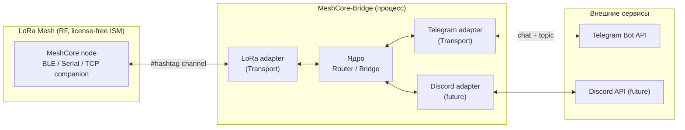
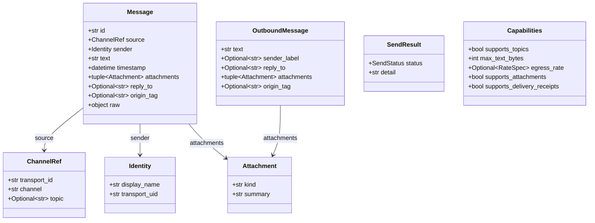
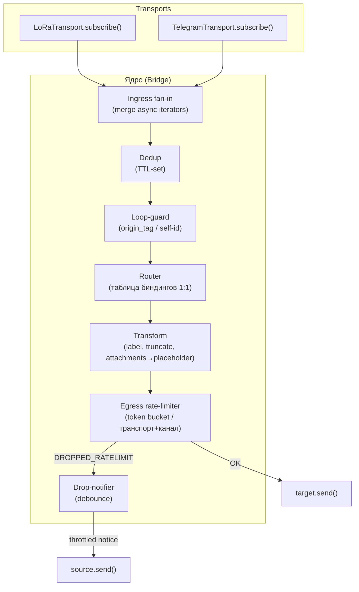
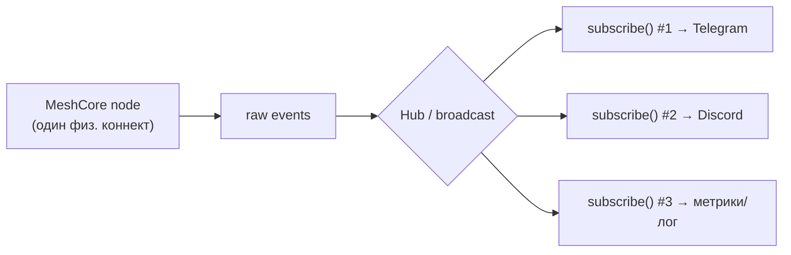
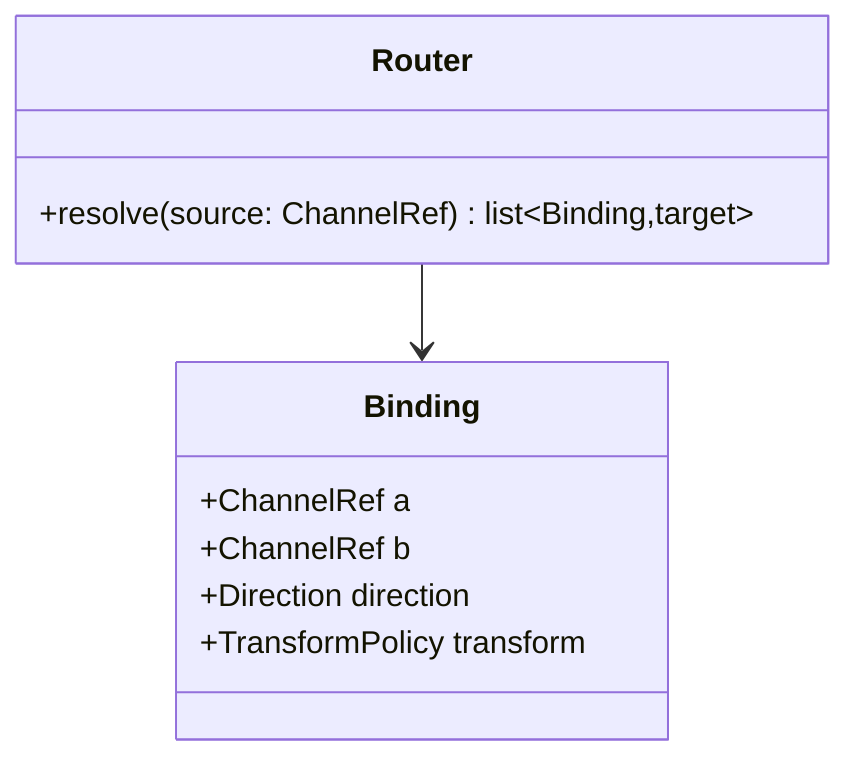
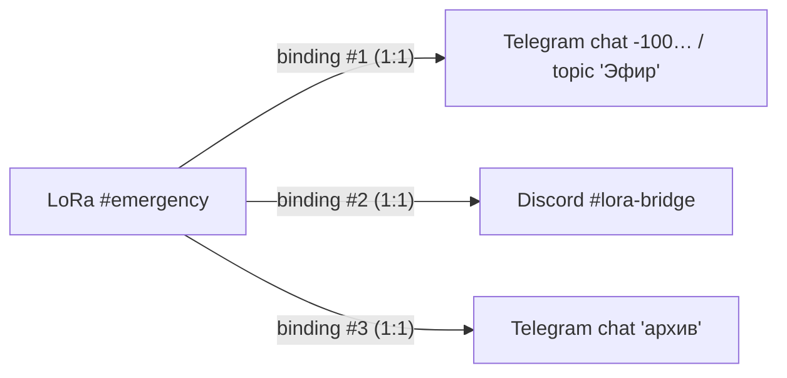
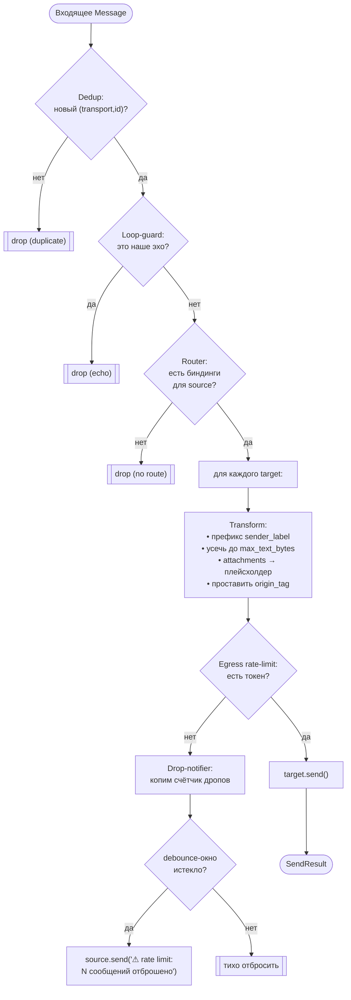
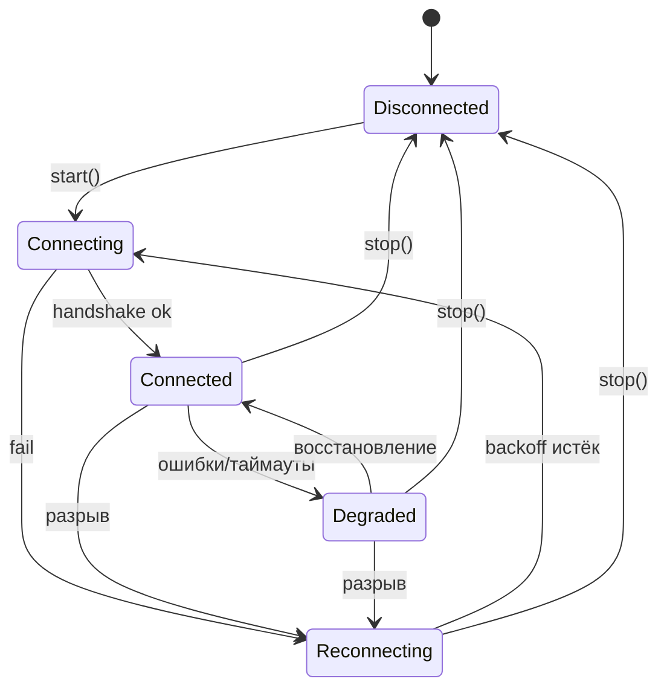
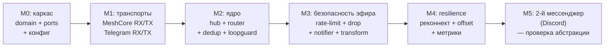

# MeshCore-Bridge — Архитектура

> Дуплексный мост между LoRa-mesh сетями (MeshCore / Meshtastic / Reticulum) и
> мессенджерами (MVP — Telegram). Документ предназначен как рабочее ТЗ: по нему
> можно реализовать систему «с нуля».

## Содержание

1. [Цели и границы](#1-цели-и-границы)
2. [Ключевые архитектурные решения](#2-ключевые-архитектурные-решения)
3. [Контекст системы (C4 L1)](#3-контекст-системы)
4. [Доменная модель](#4-доменная-модель)
5. [Порты и абстракции](#5-порты-и-абстракции)
6. [Ядро: Router / Bridge](#6-ядро-router--bridge)
7. [Реактивные потоки в asyncio](#7-реактивные-потоки-в-asyncio)
8. [Маршрутизация (1:1 → 1-ко-многим)](#8-маршрутизация)
9. [Конвейер обработки сообщения](#9-конвейер-обработки-сообщения)
10. [Жизненный цикл соединения](#10-жизненный-цикл-соединения)
11. [Конфигурация](#11-конфигурация)
12. [Структура пакета](#12-структура-пакета)
13. [🔥 Прожарка: косяки и корнер-кейсы](#13-прожарка-косяки-и-корнер-кейсы)
14. [Этапы реализации (MVP → далее)](#14-этапы-реализации)

---

## 1. Цели и границы

**Что делаем (MVP):**

- Принимаем поток сообщений из заданного **хештег-канала LoRa** (MeshCore) и
  публикуем их в **канал/тему мессенджера** (Telegram).
- Принимаем сообщения из мессенджера (с поддержкой тем/threads) и отправляем их
  обратно в LoRa-канал — **дуплекс**.
- Один LoRa-вход может быть подключён к **нескольким** мессенджерам.

**Чего сознательно НЕ делаем в MVP:**

- Не передаём вложения (фото/голос/файлы) в LoRa — только текстовые
  плейсхолдеры (`[photo]`, ссылка и т.п.).
- Не гарантируем доставку в LoRa (mesh-флуд каналов в принципе best-effort).
- Не делаем веб-UI/админку — только конфиг-файл.

**Ключевые ограничения предметной области (определяют всю архитектуру):**

| Сторона | Ограничение | Следствие для архитектуры |
|---|---|---|
| LoRa | Очень узкий канал: десятки байт полезной нагрузки на пакет, строгий **duty cycle** (EU868 — 1%) | Нужен rate-limit + усечение + защита от перегрузки |
| LoRa | Нет гарантии доставки канальных сообщений, нет backfill после простоя | At-most-once; потеря при оффлайне неизбежна |
| LoRa | Возможны дубликаты пакетов (mesh-ретрансляция) | Обязательная дедупликация |
| LoRa | Нет тем/threads, имена узлов короткие | Темы только на стороне мессенджера; маркировка отправителя |
| Telegram | Высокий объём, темы (forum topics), вложения, длинные сообщения (4096) | Источник «потопа» для LoRa; асимметрия возможностей |
| Telegram | Бот по умолчанию не видит сообщения группы (privacy mode) | Требуется отключить privacy mode у бота |
| Оба | Соединение нестабильно (BLE/Serial/TCP, long-polling) | Resilience: reconnect, resume |

---

## 2. Ключевые архитектурные решения

| # | Решение | Обоснование |
|---|---|---|
| AD-1 | **Гексагональная архитектура (ports & adapters)** | Ядро не знает про MeshCore/Telegram. Любой транспорт — это адаптер к одному порту `Transport`. |
| AD-2 | **Единый порт `Transport`** для LoRa и мессенджеров, различия описываются через `Capabilities` | Не плодим параллельные иерархии; ядро работает с абстрактным транспортом. |
| AD-3 | **Python + asyncio**, потоки = `AsyncIterator[Message]` (async-генераторы), мультикаст через внутренний hub | Нативно для I/O-bound моста; есть SDK (`meshcore`, `aiogram`). |
| AD-4 | **Маршрутизация = статическая таблица биндингов 1:1** | Простая модель; «1-ко-многим» достигается несколькими биндингами на один LoRa-эндпоинт. |
| AD-5 | **Egress rate-limit + drop + уведомление** на медленной стороне (LoRa) | Защита эфира/duty cycle; пользователь в мессенджере узнаёт о дропе. |
| AD-6 | **Loop-guard + dedup как обязательные стадии конвейера** | Дуплекс + мультикаст создают эхо-петли и дубликаты по умолчанию. |

---

## 3. Контекст системы



Дуплекс обозначен двусторонними стрелками на каждом ребре. Один `LoRa adapter`
обслуживает все мессенджеры (мультикаст в ядре), мессенджеры независимы.

---

## 4. Доменная модель

Неизменяемые (frozen) value-объекты, общие для всех транспортов.



```python
# domain/models.py
from __future__ import annotations
import datetime as dt
from dataclasses import dataclass, field
from enum import Enum
from typing import Optional


@dataclass(frozen=True)
class ChannelRef:
    """Адрес канала на конкретном транспорте.

    transport_id — идентификатор адаптера ("meshcore-1", "telegram-main").
    channel      — имя LoRa #хештег-канала или chat_id Telegram.
    topic        — message_thread_id для forum-тем; None для LoRa и обычных чатов.
    """
    transport_id: str
    channel: str
    topic: Optional[str] = None


@dataclass(frozen=True)
class Identity:
    display_name: str        # "Alex" / имя узла MeshCore
    transport_uid: str       # @username / префикс pubkey узла


@dataclass(frozen=True)
class Attachment:
    kind: str                # "photo" | "voice" | "file" | "sticker" | ...
    summary: str             # человекочитаемый плейсхолдер или URL


@dataclass(frozen=True)
class Message:
    """Входящее сообщение, нормализованное из любого транспорта."""
    id: str                  # стабильный id в рамках транспорта (для dedup)
    source: ChannelRef
    sender: Identity
    text: str
    timestamp: dt.datetime   # tz-aware, UTC
    attachments: tuple[Attachment, ...] = ()
    reply_to: Optional[str] = None
    origin_tag: Optional[str] = None  # см. loop-guard
    raw: object = None        # сырой объект SDK (для отладки)


@dataclass(frozen=True)
class OutboundMessage:
    text: str
    sender_label: Optional[str] = None  # префикс "[TG:Alex]" для LoRa
    reply_to: Optional[str] = None
    attachments: tuple[Attachment, ...] = ()
    origin_tag: Optional[str] = None


class SendStatus(Enum):
    OK = "ok"
    TRUNCATED = "truncated"          # отправлено, но усечено
    DROPPED_RATELIMIT = "dropped_ratelimit"
    FAILED = "failed"


@dataclass(frozen=True)
class SendResult:
    status: SendStatus
    detail: str = ""


@dataclass(frozen=True)
class RateSpec:
    """Лимит исходящего трафика транспорта (token bucket)."""
    msgs_per_window: int
    window_seconds: float
    burst: int = 1


@dataclass(frozen=True)
class Capabilities:
    supports_topics: bool
    max_text_bytes: int
    egress_rate: Optional[RateSpec] = None
    supports_attachments: bool = False
    supports_delivery_receipts: bool = False
```

---

## 5. Порты и абстракции

Главная абстракция — **`Transport`**. И LoRa-интерфейс, и мессенджер реализуют
один и тот же протокол. Различия (темы, лимит размера, egress-rate) выражены
декларативно через `capabilities`, а не через разные интерфейсы.

```python
# domain/ports.py
from __future__ import annotations
from typing import AsyncIterator, Protocol, runtime_checkable

from .models import Capabilities, ChannelRef, Message, OutboundMessage, SendResult


@runtime_checkable
class Transport(Protocol):
    """Дуплексный порт обмена сообщениями.

    Контракт:
      * send()      — отправить в конкретный канал/тему (исходящая сторона);
      * subscribe() — ГОРЯЧИЙ мультикаст-поток входящих сообщений
                      (каждый вызов = независимый подписчик, без переоткрытия
                       физического соединения);
      * start/stop  — управление жизненным циклом соединения.
    """

    id: str
    capabilities: Capabilities

    async def start(self) -> None: ...
    async def stop(self) -> None: ...

    async def send(self, target: ChannelRef, msg: OutboundMessage) -> SendResult: ...

    def subscribe(self) -> AsyncIterator[Message]: ...
```

Два юзкейса из ТЗ покрываются напрямую:

| Требование ТЗ | Метод порта |
|---|---|
| Отправить сообщение | `send(target, msg)` |
| Получить реактивный поток из заданного канала | `subscribe()` → фильтрация по `ChannelRef` в ядре |

> **Почему один порт, а не `LoRaPort` + `MessengerPort`?**
> Юзкейсы идентичны (send + stream). Единственная асимметрия — темы и
> ограничения — это **данные** (`Capabilities`), а не **поведение**. Разные
> интерфейсы заставили бы ядро ветвиться по типу транспорта (нарушение OCP).
> Темы живут в `ChannelRef.topic`; для LoRa там всегда `None`.

Адаптеры (примеры сигнатур, без тел):

```python
# transports/meshcore/transport.py
class MeshCoreTransport:        # implements Transport
    capabilities = Capabilities(
        supports_topics=False,
        max_text_bytes=160,                       # консервативно под LoRa-пакет
        egress_rate=RateSpec(msgs_per_window=6, window_seconds=60),  # под duty cycle
        supports_attachments=False,
        supports_delivery_receipts=False,         # канальные сообщения без ACK
    )

# transports/telegram/transport.py
class TelegramTransport:        # implements Transport
    capabilities = Capabilities(
        supports_topics=True,
        max_text_bytes=4096,
        egress_rate=RateSpec(msgs_per_window=20, window_seconds=60, burst=20),
        supports_attachments=True,
        supports_delivery_receipts=True,
    )
```

---

## 6. Ядро: Router / Bridge

Ядро ничего не знает про MeshCore/Telegram. Оно:

1. подписывается на `subscribe()` каждого транспорта;
2. прогоняет каждое сообщение через **конвейер** (dedup → loop-guard →
   routing → transform → rate-limit → send);
3. на дроп — инициирует уведомление обратно в источник.



```python
# core/bridge.py (скелет)
class Bridge:
    def __init__(
        self,
        transports: dict[str, Transport],
        router: Router,
        dedup: DedupFilter,
        loop_guard: LoopGuard,
        limiters: EgressLimiterRegistry,
        transformer: Transformer,
        notifier: DropNotifier,
    ) -> None: ...

    async def run(self) -> None:
        async with anyio.create_task_group() as tg:
            for t in self.transports.values():
                await t.start()
                tg.start_soon(self._consume, t)

    async def _consume(self, transport: Transport) -> None:
        async for msg in transport.subscribe():
            await self._handle(msg)

    async def _handle(self, msg: Message) -> None:
        if not self.dedup.accept(msg):                 # дубликат пакета
            return
        if self.loop_guard.is_echo(msg):               # наше же сообщение
            return
        for binding, target in self.router.resolve(msg.source):
            out = self.transformer.to_outbound(msg, target_caps=...)
            result = await self.limiters.send(target, out)  # rate-limit внутри
            if result.status is SendStatus.DROPPED_RATELIMIT:
                await self.notifier.note_drop(msg.source, target)
```

---

## 7. Реактивные потоки в asyncio

«Реактивный поток» = `AsyncIterator[Message]`. Критичный момент — поток должен
быть **горячим (multicast)**: на один LoRa-источник подписаны несколько
мессенджеров (1-ко-многим), и физическое соединение с узлом должно открываться
**один раз**.



Реализация мультикаста — внутренний `Hub` поверх `anyio.create_memory_object_stream`
(или `asyncio.Queue` на подписчика). Ключевые свойства:

- **Bounded buffer на подписчика** — медленный подписчик не должен тормозить
  остальных и не должен расти в памяти бесконечно. Политика переполнения буфера
  подписчика — `drop-oldest` + счётчик потерь (метрика).
- Каждый `subscribe()` создаёт независимый итератор; отписка закрывает только
  свою ветку.
- Cold→Hot: hub запускается при `start()` транспорта, а не при первом
  `subscribe()`.

> Сознательно НЕ тянем RxPY: async-генераторы + `anyio` покрывают merge / map /
> filter / buffer без тяжёлой зависимости. Если позже понадобятся сложные
> операторы (debounce, window, retry-цепочки) — `Hub` инкапсулирует переход.

---

## 8. Маршрутизация

**Модель: статические биндинги 1:1.** Один `Binding` — это атомарная пара двух
эндпоинтов + направление + политика трансформации.



```python
class Direction(Enum):
    BIDIRECTIONAL = "both"
    A_TO_B = "a_to_b"
    B_TO_A = "b_to_a"

@dataclass(frozen=True)
class Binding:
    a: ChannelRef          # обычно LoRa
    b: ChannelRef          # обычно мессенджер (chat+topic)
    direction: Direction = Direction.BIDIRECTIONAL
    transform: TransformPolicy = DEFAULT_TRANSFORM
```

### Как 1:1 даёт «1-ко-многим»

Биндинг остаётся 1:1, но **один и тот же LoRa-эндпоинт может присутствовать в
нескольких биндингах**. Router при `resolve(source)` возвращает все совпадающие
биндинги:



То есть «1-ко-многим» — это свойство **топологии** (набор биндингов), а каждый
отдельный биндинг — простой и предсказуемый 1:1. Это закрывает требование ТЗ,
сохраняя простоту правил.

**Матчинг адресов.** `resolve(source)` сравнивает `source` с `a`/`b` каждого
биндинга по `(transport_id, channel, topic)`. Для входа из мессенджера тема
обязана совпадать; для LoRa тема всегда `None`.

---

## 9. Конвейер обработки сообщения



Детали стадий:

- **Dedup** — TTL-LRU множество ключей `f"{transport_id}:{msg.id}"`. Если у LoRa
  нет надёжного `id`, ключ = `sha1(sender_uid + text + floor(ts, 5s))`.
- **Loop-guard** — два механизма:
  1. отбрасываем сообщения, у которых `sender` совпадает с собственной
     identity бота на этом транспорте (TG: игнор сообщений от своего bot id);
  2. `origin_tag`: при отправке проставляем тег `src:<transport>:<msgid>`; при
     повторном приёме (эхо канала) сверяем с «недавно отправленными».
- **Transform** — зависит от `target.capabilities`: префикс отправителя только
  если приёмник этого требует (LoRa — да; TG — нет, имя кладём в оформление);
  усечение по `max_text_bytes` **по границе UTF-8** (не разрывая многобайтовый
  символ); вложения → `summary`.
- **Egress rate-limit** — token bucket на ключ `(target.transport_id, channel)`,
  параметры из `capabilities.egress_rate`. На LoRa — жёстко под duty cycle.
- **Drop-notifier** — коалесцирует дропы за окно (напр. 60 с) и шлёт **одно**
  уведомление обратно в исходный канал/тему, чтобы не спамить.

---

## 10. Жизненный цикл соединения

Каждый транспорт — конечный автомат. Resilience обязателен: BLE/Serial рвётся,
Telegram long-poll истекает.



Разница в поведении после реконнекта:

| Транспорт | Backfill пропущенного |
|---|---|
| Telegram | Да — `getUpdates(offset)` догоняет; offset **персистится** на диск, чтобы не терять/не дублировать после рестарта процесса |
| LoRa (MeshCore) | Нет — всё, что пришло в эфир во время оффлайна, потеряно безвозвратно (это нормально для mesh) |

Backoff реконнекта — экспоненциальный с джиттером. В состоянии `Reconnecting`
egress-сообщения в эту сторону складываются в bounded-очередь с TTL (на LoRa —
маленькую; на TG — побольше).

---

## 11. Конфигурация

Один YAML-файл. Секреты (bot token, shared-secret канала) — через переменные
окружения / `${ENV}`-подстановку, не в репозитории.

```yaml
transports:
  - id: meshcore-1
    kind: meshcore
    connection:
      type: tcp            # tcp | serial | ble
      host: 127.0.0.1
      port: 5000
    channels:
      - name: "emergency"           # #хештег-канал
        secret: ${MC_EMERGENCY_SECRET}

  - id: telegram-main
    kind: telegram
    token: ${TG_BOT_TOKEN}
    # privacy mode у бота ДОЛЖЕН быть отключён (BotFather /setprivacy → Disable)

bindings:
  - a: { transport: meshcore-1,   channel: "emergency" }
    b: { transport: telegram-main, channel: "-1001234567890", topic: "42" }
    direction: both
    transform:
      lora_prefix: "[TG]"          # как подписывать сообщения в LoRa
      max_lora_bytes: 160
      attachments: placeholder     # placeholder | drop | url

  # тот же LoRa-эндпоинт во втором биндинге → 1-ко-многим
  - a: { transport: meshcore-1,   channel: "emergency" }
    b: { transport: telegram-main, channel: "-1009999999999" }   # без topic
    direction: a_to_b              # только зеркалирование LoRa → TG (архив)

policies:
  dedup_ttl_seconds: 300
  drop_notice_window_seconds: 60
  reconnect_backoff: { base: 2, max: 60, jitter: true }
```

---

## 12. Структура пакета

```
meshcore_bridge/
├── domain/
│   ├── models.py        # Message, ChannelRef, Identity, OutboundMessage, Capabilities …
│   └── ports.py         # Protocol Transport
├── core/
│   ├── bridge.py        # оркестрация конвейера
│   ├── routing.py       # Binding, Router.resolve()
│   ├── hub.py           # горячий мультикаст-поток
│   ├── dedup.py         # TTL-LRU
│   ├── loopguard.py     # эхо/origin_tag
│   ├── ratelimit.py     # token bucket + EgressLimiterRegistry
│   ├── transform.py     # label / truncate(UTF-8) / attachments
│   └── notifier.py      # debounced drop-notice
├── transports/
│   ├── meshcore/transport.py   # адаптер поверх lib `meshcore`
│   └── telegram/transport.py   # адаптер поверх `aiogram`
├── config/
│   ├── schema.py        # pydantic-модели конфига
│   └── loader.py        # YAML + ${ENV}
└── app.py               # composition root: собрать транспорты, биндинги, Bridge.run()
```

Зависимости направлены **внутрь**: `transports` и `config` зависят от `domain`;
`core` зависит только от `domain`; `domain` не зависит ни от кого.

---

## 13. 🔥 Прожарка: косяки и корнер-кейсы

Сгруппировано по природе проблемы. Для каждого — **риск** и **митигация** (и где
она живёт в коде).

### A. Петли и дубликаты

| # | Риск | Митигация |
|---|---|---|
| A1 | **Эхо-петля дуплекса.** TG→LoRa, затем тот же текст LoRa→TG (узел или мост ретранслирует) → бесконечный цикл | `origin_tag` на каждом исходящем + сверка при приёме; игнор сообщений от собственной identity бота. `loopguard.py` |
| A2 | **Петля при 1-ко-многим.** Сообщение из TG-A → LoRa → зеркалится в TG-B **и обратно в TG-A** | Router не отправляет сообщение в эндпоинт, который является его `source`; + origin_tag |
| A3 | **Дубликаты mesh-пакетов.** LoRa-флуд доставляет один пакет несколько раз | Dedup TTL-set; при отсутствии id — хеш `(sender,text,coarse_ts)`. `dedup.py` |
| A4 | **Дубликаты после рестарта.** Telegram `getUpdates` переотдаёт необработанные апдейты | Персист offset на диск; dedup переживает рестарт (опц. персист ключей) |

### B. Пропускная способность и эфир

| # | Риск | Митигация |
|---|---|---|
| B1 | **Потоп из TG в LoRa.** Активный чат мгновенно превышает duty cycle, забивает эфир | Egress token-bucket под `capabilities.egress_rate`; **drop** лишнего (решение AD-5) |
| B2 | **Спам уведомлениями о дропе.** На каждый дроп слать «rate limit» = ещё один поток сообщений | Debounce: одно агрегированное уведомление за окно с числом отброшенных. `notifier.py` |
| B3 | **Рост памяти** при медленном подписчике hub | Bounded buffer + drop-oldest + метрика потерь. `hub.py` |
| B4 | **Telegram 429 (Too Many Requests).** Сам TG тоже лимитирует (~20 msg/min в группу) | Egress-лимитер и для TG; уважать `retry_after`, ретрай с backoff |

### C. Размер и формат

| # | Риск | Митигация |
|---|---|---|
| C1 | **Сообщение длиннее LoRa-пакета** | Усечение по `max_text_bytes` **по границе UTF-8** + маркер `…`. (Фрагментация — отдельная фича пост-MVP, т.к. умножает airtime) |
| C2 | **Эмодзи/кириллица съедают «символы».** Лимит в байтах, а не символах: 1 эмодзи = до 4 байт | Считать **байты** UTF-8, не `len(str)`. `transform.py` |
| C3 | **Вложения (фото/гс/стикер/файл) не лезут в LoRa** | Политика `attachments`: `placeholder`/`url`/`drop`. По умолчанию `[photo]`-плейсхолдер |
| C4 | **Форматирование/markdown/entities Telegram** ломается при переносе | В LoRa — plain text (стрип сущностей); обратно — экранирование спецсимволов MarkdownV2 |
| C5 | **Подмена/иньекция отправителя.** Текст из LoRa вида `[TG:Admin] ...` имитирует префикс | Префикс формирует **только мост** из доверенного `Identity`; пользовательский текст санитизируется/экранируется |

### D. Идентичность, безопасность, право

| # | Риск | Митигация |
|---|---|---|
| D1 | **Кто угодно из TG вещает в эфир (RF).** Абьюз, флуд, нелегальный контент | Allow-list пользователей/чатов на запись в LoRa; per-user rate-limit; модерация |
| D2 | **Telegram bot privacy mode.** Бот по умолчанию НЕ видит обычные сообщения группы | Документировать: BotFather → `/setprivacy` → **Disable**; иначе мост «глухой» |
| D3 | **Утечка секретов** (bot token, channel shared-secret) | Только через ENV/secret-store; не логировать; не коммитить |
| D4 | **Регуляторика ISM/duty cycle/контент.** Мост может непреднамеренно нарушать правила диапазона | Жёсткий airtime-лимит (B1) + предупреждение в доках; не наша задача шифровать/обходить |

### E. Надёжность доставки и соединение

| # | Риск | Митигация |
|---|---|---|
| E1 | **LoRa send без ACK** (канальные сообщения) — не знаем, дошло ли | Семантика **at-most-once**; не ретраим вслепую (ретрай = ещё airtime). `SendResult` отражает «отправлено в эфир», не «доставлено» |
| E2 | **Конфликт ретраев и duty cycle.** Ретрай на медленной стороне усугубляет затор | Ограниченные ретраи только для FAILED-по-сети, не для DROPPED; учёт в лимитере |
| E3 | **Разрыв BLE/Serial/TCP / истёкший long-poll** | Конечный автомат §10, экспоненциальный backoff + джиттер |
| E4 | **Потеря сообщений в оффлайне LoRa** (нет backfill) | Принимаем как данность; в TG-сторону — bounded-очередь с TTL на время реконнекта |

### F. Маршрутизация и темы

| # | Риск | Митигация |
|---|---|---|
| F1 | **Группа Telegram мигрирует в супергруппу** → `chat_id` меняется (`migrate_to_chat_id`) | Обрабатывать migrate-апдейт, обновлять биндинг в рантайме + предупреждать в лог |
| F2 | **Тема удалена/переименована.** `message_thread_id` исчез | Матчинг по **id темы**, не по имени; при отсутствии — fallback в general или дроп с предупреждением |
| F3 | **General topic (без thread_id)** vs форум-темы — разное поведение | `topic=None` ≠ `topic="1"`; явно различать в `ChannelRef` |
| F4 | **Split-brain: два экземпляра моста** на одном канале → двойная публикация | Single-instance (lock-файл/лидер-элекшн); как минимум — предупреждение в доках |
| F5 | **Нет биндинга для входящего** — куда девать | Тихий drop + метрика `unrouted_total` |

### G. Порядок, время

| # | Риск | Митигация |
|---|---|---|
| G1 | **Out-of-order** из-за async + mesh-задержек | Для чата приемлемо; не пытаемся переупорядочивать. Документировать |
| G2 | **У LoRa-узла нет RTC / кривое время** | Таймстемп проставляет мост в момент ingress (UTC, tz-aware) |

### H. Состояние и рестарт

| # | Риск | Митигация |
|---|---|---|
| H1 | **Потеря offset/dedup при рестарте** → дубли или пропуски (см. A4) | Персист offset обязателен; dedup-ключи — опц. персист |
| H2 | **Грубое завершение** теряет очереди egress | Graceful shutdown: дренаж bounded-очередей с таймаутом, затем `stop()` транспортов |

### I. Наблюдаемость

| # | Риск | Митигация |
|---|---|---|
| I1 | **Сообщения «пропадают» молча** на любой стадии конвейера | Метрики на каждый drop-узел: `dropped_total{reason=...}`, dead-letter-лог |
| I2 | **Трудно отлаживать петли/дубли** | Структурный лог с `origin_tag`, `msg.id`, `binding`; трейс сквозного пути |

---

## 14. Этапы реализации



- **M0–M3 = MVP** (один LoRa ↔ один TG-топик, дуплекс, защита эфира).
- **M4** — продакшн-готовность (переживает разрывы и рестарты).
- **M5** — валидация того, что порт `Transport` действительно абстрактен:
  добавление Discord не должно трогать `core/` и `domain/`.

---

### Резюме «прожарки» одним абзацем

Три самых недооценённых места: **(1)** дуплекс + мультикаст создают эхо-петли и
дубликаты — без `loopguard` и `dedup` мост зациклится в первый же час; **(2)**
асимметрия пропускной способности — Telegram физически способен утопить LoRa, и
без egress-rate-limit это нарушит duty cycle эфира; **(3)** «реактивный поток»
обязан быть **горячим/мультикаст** — наивная реализация откроет N соединений к
узлу и сломает 1-ко-многим. Всё остальное — про честную обработку усечения
UTF-8, тем Telegram (privacy mode, миграция chat_id, thread_id) и переживание
разрывов соединения.
